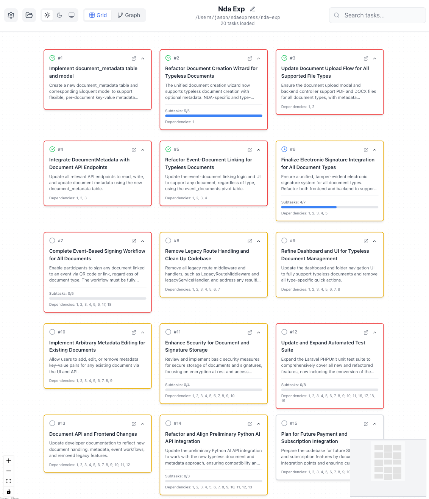

# TaskMaster Visualizer

[](https://www.npmjs.com/package/tmvisuals)
[](https://opensource.org/licenses/MIT)

Interactive mind map visualization for [TaskMaster](https://github.com/eyaltoledano/claude-task-master) projects. Visualize task hierarchies, dependencies, and progress with an intuitive web interface.

**Built for [TaskMaster](https://github.com/eyaltoledano/claude-task-master) by [@eyaltoledano](https://x.com/eyaltoledano) & [@RalphEcom](https://x.com/RalphEcom)**

## Quick Start

```bash
npx tmvisuals
```

This will automatically build and start the visualizer at `http://localhost:3001`. Use the file browser to navigate to your TaskMaster project directory.

## Features

- **Interactive Mind Maps**: ReactFlow-based visualization of task relationships
- **Hierarchy Support**: Parent tasks with subtask progress tracking
- **Dependency Visualization**: Animated connections showing task dependencies
- **Status Management**: Visual indicators and status updates
- **Editor Integration**: Open tasks directly in VSCode or Cursor
- **Multiple Layouts**: Grid view for organization, graph view for dependencies
- **Cross-Platform**: File browser works on Windows, macOS, and Linux
- **Theme Support**: Light, dark, and system theme options

## Screenshots



## Requirements

- Node.js 16+
- A TaskMaster project with a `tasks/` directory containing:
  - `tasks.json` file, OR
  - Individual `task_*.txt` files

## Installation Options

### NPX (Recommended)
```bash
npx tmvisuals                # Latest version
npx tmvisuals --port 8080    # Custom port
```

### Global Installation
```bash
npm install -g tmvisuals
tmvisuals
```

### Local Development
```bash
git clone https://github.com/zudsniper/tmvisuals.git
cd tmvisuals
npm install
npm run dev:full
```

## TaskMaster Integration

This visualizer is designed specifically for [TaskMaster](https://github.com/eyaltoledano/claude-task-master) projects. TaskMaster generates structured task files that this tool can visualize.

### Supported Task Formats

**tasks.json Format** (Primary):
```json
{
  "tasks": [
    {
      "id": 1,
      "title": "Task Title",
      "description": "Task description",
      "status": "pending",
      "priority": "high",
      "dependencies": [2, 3],
      "subtasks": [...]
    }
  ]
}
```

**Individual Files**: `task_001.txt`, `task_002.txt`, etc.

## Usage

1. **Start the visualizer**: `npx tmvisuals`
2. **Navigate to your project**: Use the file browser to find your TaskMaster project
3. **Load tasks**: Click "Load Tasks" when you reach the project directory
4. **Interact**: Click nodes for details, drag to reposition, update status

### Layout Modes

- **Grid Layout**: Organized grid view, ideal for task lists
- **Graph Layout**: Timeline-based dependency flow, shows relationships

### Status Management

Update task status directly in the interface:
- Pending (gray)
- In Progress (blue) 
- Done (green)

## Command Line Options

```bash
tmvisuals --help          # Show help
tmvisuals --version       # Show version
tmvisuals --port 3002     # Custom port
```

## Configuration

The visualizer remembers your preferences:
- Selected layout mode
- Theme preference
- Editor choice (VSCode/Cursor)
- Custom node positions

## Troubleshooting

### "No Tasks Found" Error

If you see the "No Tasks Found" message, follow these steps:

#### 1. Check Project Structure
Ensure your project has this structure:
```
your-project/
├── tasks/
│   ├── tasks.json     # Primary format
│   │                  # OR
│   ├── task_001.txt   # Individual files
│   ├── task_002.txt
│   └── ...
└── other project files
```

#### 2. Quick Setup Options

When no tasks are found, the visualizer provides several options:

- **Create Sample Tasks**: Automatically generates example tasks in your project
- **Download Template**: Get a `tasks.json` template to customize
- **Select Different Folder**: Choose a different project directory
- **View Documentation**: Access this README and setup guides

#### 3. Manual Setup

Create a `tasks/tasks.json` file with this structure:

```json
{
  "tasks": [
    {
      "id": 1,
      "title": "Setup Project",
      "description": "Initialize the project structure",
      "status": "done",
      "priority": "high",
      "dependencies": [],
      "subtasks": [
        { "id": 1, "title": "Create directory", "status": "done" },
        { "id": 2, "title": "Initialize files", "status": "done" }
      ]
    },
    {
      "id": 2,
      "title": "Development",
      "description": "Main development tasks",
      "status": "in-progress",
      "priority": "medium",
      "dependencies": [1],
      "subtasks": [
        { "id": 1, "title": "Plan features", "status": "done" },
        { "id": 2, "title": "Implement core", "status": "in-progress" },
        { "id": 3, "title": "Testing", "status": "pending" }
      ]
    }
  ]
}
```

### Common Issues

#### Permission Errors
- **Windows**: Run as Administrator if needed
- **macOS/Linux**: Check file permissions with `ls -la`
- **Solution**: Ensure read access to the project directory

#### Invalid JSON Format
- **Error**: "Invalid task file format"
- **Solution**: Validate your JSON at [jsonlint.com](https://jsonlint.com)
- **Tip**: Use the "Download Template" button for a valid starting point

#### Server Connection Issues
- **Error**: "Connection error"
- **Check**: Is the server running on the correct port?
- **Solution**: Restart with `npx tmvisuals --port 3001`

#### Live Updates Not Working
- **Check**: File watcher permissions
- **Solution**: Refresh manually or restart the application
- **Note**: Live updates require a valid `tasks/` directory

### Getting Help

If you're still having issues:

1. **Use the Feedback System**: Click "Having trouble? Send feedback" in the app
2. **Check TaskMaster Documentation**: [TaskMaster Repository](https://github.com/eyaltoledano/claude-task-master)
3. **Open an Issue**: [Create an issue](https://github.com/zudsniper/tmvisuals/issues) with:
   - Your operating system
   - Node.js version (`node --version`)
   - Project structure
   - Error messages

### Task File Formats

#### tasks.json (Recommended)
Complete task definitions with all features:
- Dependencies
- Subtasks
- Priorities
- Custom metadata

#### Individual Files
Alternative format for simple projects:
- `task_001.txt`: First line is title, rest is description
- `task_002.md`: Markdown format supported
- Automatically generates basic task structure

## API Endpoints

- `GET /api/health` - Health check
- `GET /api/browse?dir=path` - Browse directories
- `GET /api/tasks?projectPath=path` - Load TaskMaster tasks
- `GET /api/drives` - Get system drives

## Development

### Local Development
```bash
npm run dev:full     # Start both frontend and backend
npm run dev          # Frontend only (port 5173)
npm run dev:server   # Backend only (port 3001)
```

### Building
```bash
npm run build        # Build for production
npm run preview      # Preview production build
```

## Technology Stack

- **Frontend**: React 18, TypeScript, Tailwind CSS
- **Visualization**: ReactFlow 11
- **State Management**: Zustand
- **Backend**: Express.js, Node.js
- **Build**: Vite

## Contributing

Contributions welcome! This project visualizes TaskMaster data - for the core task management system, see [TaskMaster](https://github.com/eyaltoledano/claude-task-master).

## Credits

- **TaskMaster**: [@eyaltoledano](https://x.com/eyaltoledano) & [@RalphEcom](https://x.com/RalphEcom) - [Repository](https://github.com/eyaltoledano/claude-task-master)
- **Visualizer**: [@zudsniper](https://github.com/zudsniper) - [Repository](https://github.com/zudsniper/tmvisuals)

## License

MIT License - see [LICENSE](LICENSE) for details.

## Links

- **TaskMaster**: https://github.com/eyaltoledano/claude-task-master
- **Visualizer**: https://github.com/zudsniper/tmvisuals
- **NPM Package**: https://www.npmjs.com/package/tmvisuals